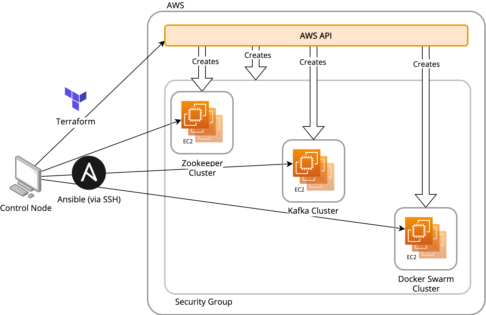

# Provisioning the Infrastructure

## How it works



The diagram above shows the flow of control in creating, provisioning, and configuring the infrastructure and applications in the cluster.

In summary:

- Everything is managed from a "control node" by applying Terraform configurations and executing Ansible playbooks.  It exists independently of the cluster itself.  This could be your local laptop, an EC2 instance in your account, or any host that can access both the AWS api and the resources that it creates.
- A Terraform configuration is applied to your AWS account that will create several EC2 instances and a security group that is applied to them.
- Ansible Playbooks are then used to:
    - Install the New Relic Infrastructure Agent
    - Install Zookeeper
    - Install Kafka
    - Install Docker
    - Create a Docker Swarm
    - Build and deploy the producer and consumer applications to the Swarm
    - Deploy a loadgen container to the Swarm

 ## Choosing and Setting Up a Control Node

As mentioned previously, all of the configuration, provisioning, and deployment is done from a single host that must meet all of the following criteria (detailed instructions following):
- Have this repository cloned to it
- Terraform installed
- Ansible installed
- AWS credentials configured
- Have access to the private key of an [EC2 key pair](https://docs.aws.amazon.com/AWSEC2/latest/UserGuide/ec2-key-pairs.html) that will be used to access the cluster via SSH.
- Be network accessible to the AWS API
- Be network accessible to port 22 of the nodes created in the cluster (by default, the security group created for the cluster opens port 22 to the world)

Generally, a good choice would be either your laptop or an EC2 instance that exists in the same VPC where you will be creating the cluster.  Due to some [Ansible constraints](http://blog.rolpdog.com/2020/03/why-no-ansible-controller-for-windows.html), this should be a host running *nix or MacOS.

Follow the instructions below to set up and configure your control node:

### Step 1: Clone this repository
Navigate to the [project homepage](https://github.com/newrelic-experimental/newrelic-kafka-playground) and use git to clone the repository.

### Step 2: Install the Terraform CLI
Follow the instructions in the Terrafrom tutorial to [install the Terraform CLI](https://learn.hashicorp.com/tutorials/terraform/install-cli).

### Step 3: Install Ansible
There are several ways to install Ansible, which are outlined in the [documentation](https://docs.ansible.com/ansible/latest/installation_guide/intro_installation.html).
However, the most foolproof way is to [install via `pip` within a Python virtual environment](https://docs.ansible.com/ansible/latest/installation_guide/intro_installation.html#virtual-environments) running Python version 3.6 or above.

If you are receiving errors about missing or mismatched Python packages, particulary related to OpenSSL and/or GnuPG when installing packages on the remote hosts, your Ansible installation and the underlying Python version are most likely the culprit.  Your best path forward from here would be to reinstall it in a virtual environment.

### Step 4: Configure/Verify your AWS credentials
The Terraform CLI uses the AWS API to create all of the infrastructure in the cluster.  Therefore, it requires the proper credentails to execute those API requests on your behalf.  View the [documentation for the Terraform AWS Provider](https://registry.terraform.io/providers/hashicorp/aws/latest/docs) to understand the various methods you can use to provide your credentials.

If you have previously [configured the AWS CLI](https://docs.aws.amazon.com/cli/latest/userguide/cli-configure-quickstart.html), you should already have a credentials file in `~/.aws/credentials`.  Terraform will automatically read a profile from there.

### Step 5: Configure/Create/Verify your AWS Keypair
After the infrastructure has been created by Terraform, we'll use Ansible to install and configure all of the software on each instance.  This is done by connecting to each host via SSH which requires the private key portion of an [EC2 key pair](https://docs.aws.amazon.com/AWSEC2/latest/UserGuide/ec2-key-pairs.html) to be present on the control node.  Because the infrastructure is being created via automation (as opposed to using the UI), the key pair must exist before you attempt to create the infrastructure.  Either choose an existing key pair, or create one specifically for this cluster.  Be sure you have downloaded the private key `.pem` file, and make note of the key pair name.

## Creating the Infrastructure
Once your control node is properly configured, you'll use the Terraform CLI to create all of the infrastructure in AWS.  All of the Terraform configurations for the project are in the `terraform` subdirectory.

### Step 1: Configure Your Playground
Begin by `cd`-ing into the `terraform/playground` directory.

Copy the file named `terraform.tfvars.sample` to `terraform.tfvars`.  Terraform will read this file and set any variables it contains, overriding any provided defaults.  Open the file and replace the sample values with your own.
At minimun, you need to provide an AWS region, a New Relic License Key, and the name of the key pair that you'll be using.  **This is also where you can override the default settings for the size and number of nodes in the cluster.**  In fact, you can override any variable that is declared in `variables.tf`.

By default, Terraform will create all of the resources in your default VPC.  If you want to use a different VPC, you must create and properly configure one beforehand and override the `vpc_id` variable with the VPC's id.

### Step 2: Initialize Terraform
Within the `terraform/playground` directory, run:
```bash
> terraform init
```

### Step 3: Create the Resources
Within the same directory, run:
```bash
> terraform apply
```
Terraform will determine what needs to be created (at this point, that should be everything), and will ask you to verify before applying the changes.  Confirm, and wait while the resources are created.

At any time you can verify what Terraform has created by running `terraform show`

All of the resources created by this configuration can be destroyed with `terraform destroy`

## Installing the software
Now we'll use Ansible to install and configure all of the software on the hosts we just created.  After creating all the resources, Terraform will create an [Ansible inventory file](https://docs.ansible.com/ansible/latest/user_guide/intro_inventory.html) that we'll use in all of the `ansible_playbook` commands going forward. It is located in `terraform/playground/output/ansible_hosts.yml`

### Step 1: Install New Relic Infrastructure
`cd` into the `ansible-playbooks` directory within the repo.

Run the following command:
```bash
> ansible_playbook -i ../terraform/playground/output/ansible_hosts.yml --private-key=path/to/your/key.pem newrelic-infrastructure.yml
```
Notice that you must provide the path to the Ansible inventory file with the `-i` switch and the path to your private key with the `--private-key` switch.

This will install the New Relic Infrastructure Agent on all of the hosts in the inventory.

Verify that the hosts are reporting by navigating to the Entity Explorer in New Relic One.

### Step 2: Install Zookeeper
Run the following command:
```bash
> ansible_playbook -i ../terraform/playground/output/ansible_hosts.yml --private-key=path/to/your/key.pem zookeeper.yml
```

### Step 3: Install Kafka
Run the following command:
```bash
> ansible_playbook -i ../terraform/playground/output/ansible_hosts.yml --private-key=path/to/your/key.pem kafka-brokers.yml
```

Verify that the [New Relic Kafka On-Host Integration](https://docs.newrelic.com/docs/integrations/host-integrations/host-integrations-list/kafka-monitoring-integration) is collecting data from the Kafka brokers.
 - Navigate to the Entity Explorer in New Relic One.  In the left-hand column you should see "Kafka brokers" listed as an Entity type.  Click on them to view some of the metrics they are reporting
 - Use the Data Explorer to view samples of the metrics and events generated by the integration (listed in the integration documentation linked above)
 - Navigate to Infrastrucutre > Third Party Services to view the Kafka Integration summary dashboard.

You'll notice that while data is being reported from the integration, all or most of the values are null or 0 since there is no data passing through the cluster.

Proceed with installing the applications to generate message throughput.

# Installing the applications
Within the `applications` directory is the source code for two applications:
- `producer`: a minimimal RESTful web service that receives requests at an HTTP endpoint and produces a message to a Kafka topic named `application-messages`
- `consumer`: a standalone application that reads and processes messages from the `application-messages` topic.

Additionally, the directory contains all of the configuration files for deploying the applications (plus a load generator) to the Docker Swarm cluster we created previously.

A single Ansible playbook will do the following:
- Install Docker on the nodes in the cluster
- Create a Swarm with a manager and worker nodes
- Copy the application source code to the manager node
- Build the containers (including compiling the source code)
- Deploy the services to the Swarm

To run it:

```bash
> ansible_playbook -i ../terraform/playground/output/ansible_hosts.yml --private-key=path/to/your/key.pem application-stack.yml
```

Once the applications are deployed, verify that messages are passing through the topic:

- Revisit the Kafka broker entities and the Kafka integration dashboard.  You should see data now.
- Verify that you have both applications, `newrelic-kafka-playground-producer` and `newrelic-kafka-playground-consumer`, in the list of services in the Entity Explorer.  Verify that both are receiving throughput and are processsing transactions
- View distributed traces for either application.  Verify that the traces contain spans from both the producer and consumer and show the passing of messages between them through the Kafka topic.  Click on the spans and view the attributes that are attached to them identifying the topic, partition, and offset.
- View logs from both applications.  This can be done via the Logs UI, or by clicking "View Logs" when viewing a Distributed Trace, in which case you can see the logs that were emitted in-context for that individual trace.

If you'd like to experiment with features or simulate some other messaging use cases, simply edit the code in the `applications` directory and run the `application-stack.yml` playbook. By adding the `deploy` tag, it will only run the tasks that build and deploy the application.

```bash
> ansible_playbook -i ../terraform/playground/output/ansible_hosts.yml --private-key=path/to/your/key.pem --tags "deploy" application-stack.yml
```

This is all done on the Swarm manager node, so there is no need to install Java nor Docker.
